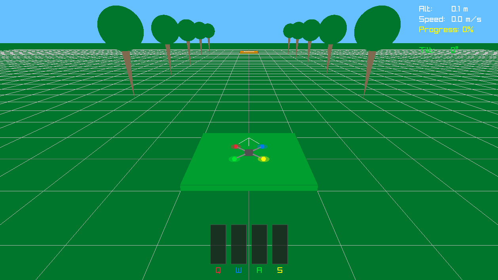

# QWAS - Quadrotor With Awkward Strokes



QWAS is a small 3D drone physics game inspired by QWOP. Instead of controlling a runner's legs, you control a quadrotor's four propellers independently. Coordinating four thrust sources into stable flight is harder than it sounds.

[Try it here now!](https://chiaxr.github.io/QWAS/)

## Gameplay

Hold a motor input to ramp up that motor's thrust; release it and the thrust drops quickly.

```text
Q  W    front motors
A  S    rear motors
```

| Input | Motor | Color |
| --- | --- | --- |
| Q / top-left quadrant | Front-left | Red |
| W / top-right quadrant | Front-right | Blue |
| A / bottom-left quadrant | Rear-left | Green |
| S / bottom-right quadrant | Rear-right | Yellow |

Goal: fly from the green starting pad to the orange landing pad 25 meters ahead. Land gently with low speed and low tilt for a perfect win.

Crash condition: any rotor hits the ground outside the starting or landing pad.

## Easy Mode

The main menu includes an optional `EASY MODE` toggle. It is off whenever the application starts and is preserved only across retries in that application session. While motor buttons are held, Easy Mode permits ordinary deliberate tilt and only intervenes near danger. After release, it smoothly removes stale player differential thrust and blends into an upright pitch/roll PD controller with a small learned two-axis residual. Its deterministic collective target stays below hover, so a settled no-input drone slowly descends.

The deployed actor is a dependency-free `32 -> 32 -> 32 -> 2` C++ MLP baked into both native and web builds. It never adds learned collective lift, yaw torque, goal navigation, or horizontal-position control. Training, release evaluation, portable v2 weight export, native overrides, measured results, and the exact observation/reward specification are documented in [doc/stability_assist.md](doc/stability_assist.md).

## Controls

| Input | Action |
| --- | --- |
| Q / W / A / S <br> Touch quadrant | Hold to increase motor thrust; release to cut it |
| Up / Down | Navigate the menu, or adjust the selected physics setting when in Settings |
| Left / Right | Adjust the selected physics setting in Settings, or choose Retry/Menu on the crash/win screens |
| Enter / Space <br> Mouse click / Tap | Select the highlighted menu, settings-exit, or crash/win-screen option |
| R | Reset physics settings to defaults (in Settings), or restart (during flight or on crash/win) |
| Backspace / Esc | Back out to the main menu |
| Esc / window close | Quit native desktop build |

The web version is landscape-only. In portrait orientation the canvas is hidden, the game is paused, and a rotate prompt is shown until the viewport returns to landscape.

## Native Build

Requirements: CMake 3.16+, a C++17 compiler, and Git. raylib 6.0 is fetched automatically by CMake.

The native desktop commands are unchanged:

```bash
cmake -S . -B build -DCMAKE_BUILD_TYPE=Release
cmake --build build
```

Run the native executable:

```bash
./build/QWAS
```

Optionally load compatible development weights without recompiling (the baked actor remains the fallback):

```bash
./build/QWAS --assist-weights models/stability_assist.qwasmlp
```

The portable model format is version 2. Older 28-input/four-output Easy Mode files are rejected with the baked model retained safely.

On Windows with Visual Studio generators, the executable is typically under:

```powershell
build\Debug\QWAS.exe
```

Platform notes:

- macOS native builds link Cocoa, IOKit, and OpenGL frameworks.
- Linux native builds use the normal raylib desktop dependencies such as OpenGL and X11/Wayland development packages.
- The desktop build does not depend on Emscripten, JavaScript, or web files.

## Local Emscripten Build

Install and activate Emscripten first, then configure with `emcmake`:

```bash
emcmake cmake -S . -B build-web \
  -DCMAKE_BUILD_TYPE=Release \
  -DQWAS_BUILD_NATIVE=OFF \
  -DQWAS_BUILD_WEB=ON

cmake --build build-web --target qwas_web
```

Expected outputs:

```text
build-web/dist/index.html
build-web/dist/index.js
build-web/dist/index.wasm
```

Serve locally with:

```bash
emrun build-web/dist/index.html
```

You can also serve `build-web/dist` with any static file server.

## Project Structure

```text
QWAS/
|-- CMakeLists.txt
|-- .github/workflows/pages.yml
|-- include/
|   |-- drone.h
|   |-- game.h
|   |-- stability_assist.h
|   |-- generated/stability_assist_weights.h
|   `-- qwas_app.h
|-- src/
|   |-- drone.cpp
|   |-- game.cpp
|   |-- main.cpp
|   |-- qwas_app.cpp
|   |-- stability_assist.cpp
|   `-- web/
|       `-- web_main.cpp
|-- web/
|   `-- emscripten_shell.html
|-- models/
|   `-- stability_assist.qwasmlp
|-- tests/
|   |-- stability_assist_test.cpp
|   `-- data/
`-- doc/
    |-- stability_assist.md
    |-- stability_assist_evaluation.json
    `-- qwas.png
```

`qwas_game` contains the shared drone, game, and application code. `QWAS` is the native launcher. `qwas_web` is the Emscripten launcher and uses `emscripten_set_main_loop()`.
